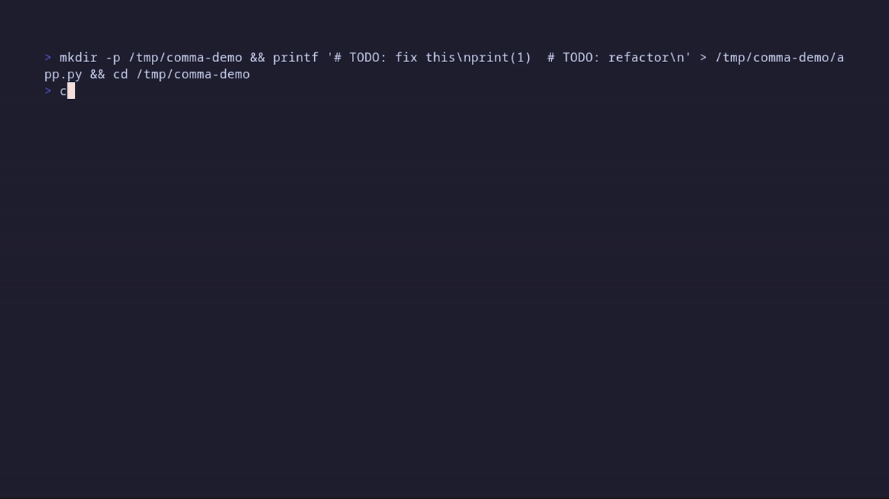
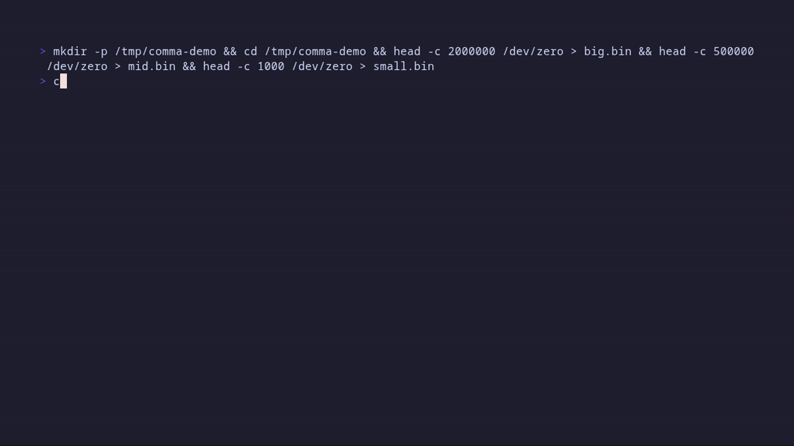

# `,` — The smallest CLI that changes everything

> **Stop googling shell commands.** Type what you want, get the command, run it.

[](LICENSE)
[](https://github.com/miuzel/comma-cli/releases)
[]()

```bash
# Linux / macOS — install in 10 seconds
curl -sSL https://github.com/miuzel/comma-cli/releases/latest/download/install.sh | bash

# or via Homebrew (macOS / Linux)
brew install miuzel/tap/comma-cli
```

```powershell
# Windows (PowerShell) — install to D:\tools\bin
$dir = "D:\tools\bin"; Invoke-WebRequest -Uri "https://github.com/miuzel/comma-cli/releases/latest/download/comma-windows-x86_64.zip" -OutFile "$dir\comma.zip"; Expand-Archive -Path "$dir\comma.zip" -DestinationPath $dir -Force; Rename-Item "$dir\comma.exe" "c.exe"; Remove-Item "$dir\comma.zip"
```

```bash
# Use it
, find all TODO comments in python files
# → rg -n TODO --type py  # Find TODO comments in Python files
# → [Enter] to execute
```

**That's it.** No sessions, no runtime, no dependencies. Just a 2.5MB binary that turns intent into shell commands.

---

## Demo

### Basic usage

<!-- Record: vhs demo/basic-usage.tape -->

### Edit & refine

<!-- Record: vhs demo/edit-refine.tape -->

### Multi-candidate selection

<!-- Record: vhs demo/multi-candidate.tape -->

### i18n support

<!-- Record: vhs demo/i18n.tape -->

---

## The problem

You're in the terminal. You want to:
- Compress a video for Slack
- Find files modified today larger than 100MB
- Check which ports are in use
- Extract audio from a video file

You know *what* you want, but can't remember the exact flags. So you:
1. Open a browser
2. Search "ffmpeg compress video"
3. Read 3 Stack Overflow answers
4. Copy-paste something that might work
5. Debug it for 5 minutes

**Or you could just type:**
```bash
, compress video to 10mb
# → ffmpeg -i input.mp4 -b:v 8M -b:a 128k output.mp4
```

---

## `,` vs ChatGPT / Codex / Claude Code

**The key difference:** `,` is a **command generator**, not an **agent**.

| | `,` | ChatGPT / Codex / Claude Code |
|---|---|---|
| **What it does** | Generates ONE shell command | Has conversations, writes code, executes tasks |
| **State** | Stateless — no memory between calls | Maintains conversation history |
| **Scope** | Single command | Multi-file editing, refactoring, debugging |
| **Size** | 2.5MB binary | 100MB+ runtime (Node.js, Python) |
| **Startup** | Instant | 2-5s cold start |
| **Dependencies** | None | Node.js, Python, npm, etc. |
| **Privacy** | Placeholders (no personal data sent) | Full context sent |
| **Use case** | "I need a command" | "I need to build a feature" |

### When to use `,`

```bash
# You know what you want, just need the command
, find all TODO comments in python files
, compress video to 10mb
, check which ports are in use
```

### When to use ChatGPT/Claude

```
# You need a conversation, not just a command
"Help me refactor this function to be more efficient"
"Debug why this test is failing"
"Write a Python script that processes CSV files"
```

**Think of it this way:**
- ChatGPT is a **conversation partner** — you talk back and forth
- `,` is a **command translator** — you say what you want, get the command, done

**The `,` philosophy:** The terminal is for *doing*, not *talking*. One intent → one command → execute → done.

---

## Features

### 🔄 Multi-provider fallback

Configure multiple providers with automatic fallback:

```json
{
  "providers": {
    "cerebras": {
      "base_url": "https://api.cerebras.ai/v1",
      "auth_token": "csk-xxx",
      "api_style": "openai"
    },
    "anthropic": {
      "base_url": "https://api.anthropic.com",
      "auth_token": "sk-ant-xxx"
    }
  },
  "models": [
    {"provider": "cerebras", "model": "llama-3.3-70b", "retries": 2},
    {"provider": "anthropic", "model": "claude-sonnet-4-20250514", "retries": 1}
  ]
}
```

`api_style` can be `"openai"` (chat completions, the default), `"responses"` (OpenAI Responses API, `/v1/responses`) or `"anthropic"`. It's auto-detected from the base URL (`anthropic` or `responses` in the URL) when omitted.

### ✏️ Edit before execution

After getting a command, you can:
- **Enter** — Execute as-is
- **e** — Edit inline (pre-filled, use arrow keys)
- **r** — Refine via LLM ("add --dry-run")
- **Esc** — Cancel

### 🤖 Auto-confirm mode

For scripts and agents, add `!` to skip all confirmations:

```bash
, find large files !          # auto-execute
, compress video to 10mb !    # auto-explore + auto-execute
```

### 🔍 Smart tool discovery

The model checks what's installed before suggesting commands:

```
$ , compress this image
▸ Checking: convert magick ffmpeg
  Available: ffmpeg
  Not found: convert, magick
ffmpeg -i input.png -quality 85 output.jpg
```

### 📦 Self-update

Check for updates and update the binary from GitHub releases:

```bash
, --update
# ▸ Checking for updates (current: 0.22.3)...
#   Update available: 0.22.3 → 0.23.0
# Release notes (0.23.0):
#   ...changelog...
# Upgrade now? [Enter/y/N]
# ▸ Updated to 0.23.0
```

The release changelog is shown before you confirm — the binary is never replaced unasked. The downloaded archive is verified against the release's `sha256sums.txt` before the binary is replaced.

The weekly auto-update check (`auto_update` in the config) works the same way: when a new version is found, the changelog is shown and you choose whether to upgrade. Declining offers to disable future checks — answering `y` writes `auto_update: false` to your config for you.

### 📚 Exploration mode

When unsure about a tool, the model runs help first:

```
$ , compress video using ffmpeg
▸ Exploring: ffmpeg -h
▸ Learning from output...
ffmpeg -i input.mp4 -b:v 8M output.mp4
```

Probe commands always ask for confirmation before running (a single probe too), unless you pass `!`.

### 🌐 Web search

When the answer depends on current information (latest versions, recent changes, download URLs), the model can search the web first via `#SEARCH:`:

```
$ , upgrade rust to the latest stable release
▸ Searching the web: latest stable rust version
rustup update stable  # Update Rust to the latest stable toolchain
```

Search results (titles, URLs, snippets) are fed back to the model, which then generates the final command. Backends that can return richer per-result content do so natively — no page fetching on our side: Tavily includes the cleaned page text (`search_depth: "advanced"` + `include_raw_content` — note the advanced depth costs 2 credits per search), Brave uses the LLM Context endpoint (`/res/v1/llm/context`), which returns pre-extracted page content made for LLM grounding — included in every Search plan; DuckDuckGo, Mojeek and SearXNG only have snippets. **Search is off by default** — pick a backend in the `search` config to enable it (see below). Brave and Tavily need an API key; DuckDuckGo and Mojeek are keyless but scrape result pages, which can trigger anti-bot measures on some networks; a self-hosted SearXNG instance works great too. Search queries are model-generated and never contain your username, hostname, or paths.

### 🌍 Multi-language UI

The interface speaks 9 languages — English, 中文, 日本語, 한국어, Français, Deutsch, Español, Português, Русский:

```bash
COMMA_LANG=fr , --help    # or set "lang": "fr" in config.json
```

Language is auto-detected from your system locale (`LANG`/`LC_ALL`); `COMMA_LANG` overrides it, and `lang` in the config takes top priority.

---

## Recommended Models

`,` works with any OpenAI or Anthropic compatible API. Here are some great options:

### 🚀 Fast & Free

| Provider | Model | Speed | Cost | Best for |
|----------|-------|-------|------|----------|
| [Cerebras](https://cerebras.ai) | `gemma-4-31b` | ⚡ Ultra-fast | Free tier | Quick commands, high throughput |
| [Groq](https://groq.com) | `llama-3.1-8b-instant` | ⚡ Ultra-fast | Free tier | Low latency, real-time use |

### 💻 Coding-Optimized

| Provider | Model | Best for |
|----------|-------|----------|
| [Moonshot](https://kimi.moonshot.cn) | `kimi-k2.7-coding` | Shell commands, code generation |
| [DeepSeek](https://deepseek.com) | `deepseek-v4-flash` | Fast inference, coding tasks |

### 🏠 Local (No API key needed)

| Tool | Model | Best for |
|------|-------|----------|
| [Ollama](https://ollama.ai) | `qwen3.6-35b-a3b` | Privacy, offline use |
| [vLLM](https://vllm.ai) | Any model | Self-hosted, high throughput |

### Example configs

**Cerebras (fast, free):**
```json
{
  "base_url": "https://api.cerebras.ai/v1",
  "auth_token": "your-api-key",
  "model": "gemma-4-31b"
}
```

**Ollama (local):**
```json
{
  "base_url": "http://localhost:11434/v1",
  "auth_token": "ollama",
  "model": "qwen3.6-35b-a3b"
}
```

**DeepSeek:**
```json
{
  "base_url": "https://api.deepseek.com/v1",
  "auth_token": "your-api-key",
  "model": "deepseek-v4-flash"
}
```

**Multi-provider fallback:**
```json
{
  "providers": {
    "cerebras": {
      "base_url": "https://api.cerebras.ai/v1",
      "auth_token": "csk-xxx"
    },
    "deepseek": {
      "base_url": "https://api.deepseek.com/v1",
      "auth_token": "sk-xxx"
    },
    "ollama": {
      "base_url": "http://localhost:11434/v1",
      "auth_token": "ollama"
    }
  },
  "models": [
    {"provider": "cerebras", "model": "gemma-4-31b", "retries": 2},
    {"provider": "deepseek", "model": "deepseek-v4-flash", "retries": 1},
    {"provider": "ollama", "model": "qwen3.6-35b-a3b", "retries": 1}
  ]
}
```

---

## Quick start

### One-shot mode

```bash
, find all TODO comments in python files
# → rg -n TODO --type py  # Find TODO comments in Python files

, list files larger than 1G
# → fd --size +1G  # Find files larger than 1GB

, what is my ip
# → curl -s ifconfig.me  # Get public IP address
```

Only *leading* arguments are parsed as flags — everything after the first intent word is intent text, verbatim, and `--` ends flag parsing explicitly. So intents containing `-` words just work:

```bash
, grep -v pattern        # intent: "grep -v pattern"
, use curl -V            # intent: "use curl -V"
```

### Piped mode

```bash
echo "find large files" | ,     # generates, then asks for a "y" line on stdin
echo "find large files" | , !   # skips confirmation (scripting / agents)
```

With piped stdin, `,` never auto-executes: it reads one line from stdin and runs the command only if that line is `y`.

### Interactive mode

```bash
,
> find large files
fd --size +100M  # Find files larger than 100MB
▸ Next: 'x' exec/edit/refine, 'c' copy, 'q' quit.
> sort by size descending
fd --size +100M -x ls -lh {} + | sort -k5 -h -r
▸ Next: 'x' exec/edit/refine, 'c' copy, 'q' quit.
> x  # execute
```

Every generated command is followed by exactly one hint line telling you what you can do with it — `▸ Next: 'x' exec/edit/refine, 'c' copy, 'q' quit.` — so a fresh command never leaves you wondering how to run it. It is printed once per command (the REPL never repeats it) and only in interactive mode: one-shot and piped-stdin runs are unchanged.
If the command you executed exits non-zero, `,` automatically refines it: the failed command, its exit code and a truncated summary of its output go back to the model, and the corrected command is printed for you to run with `x` (nothing is auto-executed). You can also refine at the main prompt, without executing anything first:

```bash
> /refine use ripgrep instead of grep   # alias: /r
```

See [Auto-refine after a failure](#auto-refine-after-a-failure) for what is sent and how to turn it off.

### Keyboard shortcuts

| Key | Action |
|-----|--------|
| `Tab` | Autocomplete filename |
| `↑`/`↓` | Select candidate |
| `Enter` | Confirm / Execute |
| `Esc` | Cancel |
| `e` | Edit command |
| `r` | Refine via LLM |
| `x` | Execute (interactive mode) |
| `/refine TEXT` | Refine the current command directly (alias `/r`) |
| `c` | Copy to clipboard |
| `q` | Quit |

---

## Shell integration

By default `,` runs the confirmed command in a **child process**, so a `cd` or `export` is lost when it exits. With a small wrapper function, commands run in your **current shell** instead (navi/fzf-style): the binary appends each confirmed command to the file named by `COMMA_EVAL_FILE` (one per line), and the wrapper evaluates that file in the current shell after `,` exits.

In eval mode the command runs in the wrapper, not in `,`, so there is no exit code and no output to inspect: automatic refine never triggers there (and output is not captured either).

### bash / zsh

Add to `~/.bashrc` or `~/.zshrc`:

```bash
,() {
    local f; f=$(mktemp)
    COMMA_EVAL_FILE="$f" command , "$@"
    local ec=$?
    [ -s "$f" ] && eval "$(cat "$f")"
    rm -f "$f"
    return $ec
}
```

### PowerShell

Add to your `$PROFILE` (the function is named `comma` because `,` is reserved in PowerShell):

```powershell
function comma {
    $f = New-TemporaryFile
    try {
        $env:COMMA_EVAL_FILE = $f.FullName
        $env:COMMA_EVAL_SHELL = 'powershell'
        comma.exe @args
    }
    finally {
        Remove-Item Env:COMMA_EVAL_FILE -ErrorAction SilentlyContinue
        Remove-Item Env:COMMA_EVAL_SHELL -ErrorAction SilentlyContinue
    }
    if (Test-Path $f) {
        $c = Get-Content $f -Raw; Remove-Item $f
        if ($c) { Invoke-Expression $c.Trim() }
    }
}
```

`COMMA_EVAL_SHELL` tells the model which shell dialect to generate for: since the wrapper evals in PowerShell, this makes it emit PowerShell syntax (`$env:USERPROFILE`, `~`) instead of cmd syntax (`%USERPROFILE%`). (bash/zsh need no such hint — `$SHELL` already drives the dialect.)

### cmd.exe

Save as `comma.cmd` somewhere in `PATH` (before or alongside `comma.exe`):

```bat
@echo off
set "F=%TEMP%\comma-eval-%RANDOM%-%RANDOM%.cmd"
set "COMMA_EVAL_FILE=%F%"
comma.exe %*
set "COMMA_EVAL_FILE="
if exist "%F%" ( call "%F%" & del "%F%" )
```

`%*` passes the arguments through; `call` runs the eval file in the current cmd session, so a `cd` actually changes your directory. No `COMMA_EVAL_SHELL` is needed here — cmd.exe is already the reported dialect on Windows when `SHELL` is unset.

Notes:
- `, go to the temp directory` → `cd /tmp` now actually changes your directory.
- In interactive mode each executed command is appended to the file; the wrapper evals them in order when the session exits.
- Without the wrapper nothing changes — commands run in a child process as before (a bare `cd` there prints a note pointing here).

---

## Configuration

### Priority

```
COMMA_* environment variables
  ↓
~/.config/comma/config.json   (XDG; $XDG_CONFIG_HOME honored)
  ↓
,.config.json next to the binary   (portable installs)
  ↓
~/.local/bin/,.config.json    (legacy, still read if present)
  ↓
~/.claude/settings.json
  ↓
Built-in defaults
```

The same chain applies to the cache (`~/.cache/comma/cache.json`, `$XDG_CACHE_HOME` honored) and `additional_prompt.md` — so a directory containing the binary plus `,.config.json`, `,.additional_prompt.md`, and `,.cache.json` is fully portable. On Windows they default to `%APPDATA%\comma\` (binary-adjacent and legacy files are still read). The opt-in REPL history is the exception: it only ever lives in `$XDG_STATE_HOME/comma/history` (`%APPDATA%\comma\history` on Windows), with no portable or legacy fallback, and the file does not exist at all unless `"history": true` is set.

### Environment variables

```bash
export COMMA_BASE_URL="https://api.cerebras.ai/v1"
export COMMA_API_KEY="csk-xxx"
export COMMA_MODEL="llama-3.3-70b"
export COMMA_API_STYLE="openai"
```

### Minimal config

```json
{
  "base_url": "https://api.cerebras.ai/v1",
  "auth_token": "csk-xxx",
  "model": "llama-3.3-70b"
}
```

### Tool preferences

```json
{
  "prefer": {
    "editor": ["nvim", "vim"],
    "list": ["eza", "ls"],
    "grep": ["rg", "grep"],
    "find": ["fd", "find"]
  }
}
```

### Response cache

Repeated intents are answered from `~/.cache/comma/cache.json` (default cap: 1000 entries). The cache is checked for all configured models in fallback order before any network request, so a cached fallback answer avoids a slow or unreachable primary call. Set `"cache_size": 0` in the config to disable the cache entirely.

### REPL input history (opt-in, off by default)

Set `"history": true` to remember what you type in interactive mode, so `↑` recalls earlier intents in the next session:

```json
{ "history": true }
```

The history is stored in `$XDG_STATE_HOME/comma/history` (default `~/.local/state/comma/history`; `%APPDATA%\comma\history` on Windows). It is written once when you leave the REPL with `q`/`quit`/`exit`, is readable by your user only (`0600`, because it contains your raw intents), keeps the newest 1000 entries, and is never sent to the API. While the key is absent or `false`, nothing is read or written and no history file is created — `, --setup` has a toggle for it. Only what you type at the REPL prompt is saved; text entered for the in-session `e` (edit) and `r` (refine) prompts is not persisted.
### Auto-refine after a failure

In the interactive REPL, a command that exits **non-zero** (including one killed by a signal) automatically starts a refine turn: the failed command, its exit code and a summary of its output are sent to the model, and the corrected command is printed — you still press `x` to run it. Nothing is executed automatically, and each executed command triggers this at most once. Non-TTY runs (one-shot, piped stdin) and `COMMA_EVAL_FILE` eval mode never auto-refine.

Disable it in the config:

```json
{
  "auto_refine": false
}
```

or toggle it in `, --setup`. With `auto_refine: false` the command runs with inherited stdio exactly as before — no pseudo-terminal is allocated and nothing is captured.

While auto-refine is enabled, `,` needs the command's output for the summary, so the child runs **on a pseudo-terminal** that `,` relays live:

- output streams to your terminal as it is produced — nothing waits for the command to exit;
- the child keeps full TTY semantics: colors and progress bars render as usual and full-screen programs (`vim`, `less`, ...) work — the terminal size is forwarded at startup and re-synced on a window resize;
- your typing, and `Ctrl-C` (which interrupts the command), are forwarded to the command;
- your terminal is put in raw mode for the duration and is always restored afterwards — normal exit, `Ctrl-C` or a fatal signal;
- a bounded copy of the output (first + last 32 KB) is kept for the summary, so an endless command (`yes`, a chatty daemon) cannot grow it without bound.

**Windows** has no pseudo-terminal support yet: output still streams live and stdin is inherited, but the child sees pipes rather than a TTY, so colors/progress bars may be missing and full-screen programs (`vim`, `less`) do not work there — use `auto_refine: false` for those. The same piped mode is used on a Unix host where no pty can be allocated, and `,` says so instead of degrading silently.

What is sent is bounded and sanitized: ANSI escapes and control characters are stripped, the summary is truncated to 2000 characters (head + tail, because errors usually land at the end), and an empty output sends only the command and the exit code. Real `$HOME`, username and hostname are replaced by `{{HOME}}`/`{{USER}}`/`{{HOSTNAME}}` before anything is sent (see [Privacy](#privacy)) — masking happens before truncation, so a half-cut path can never leak.

### Reasoning (Anthropic)

For Anthropic models, `"reasoning": <tokens>` enables extended thinking with that budget. `max_tokens` is raised automatically, so budgets ≥ 1024 work.

### Web search

Backend for the `#SEARCH:` protocol (see the Web search feature above):

```json
{
  "search": {
    "provider": "off",
    "api_key": "",
    "base_url": "",
    "max_results": 5
  }
}
```

Providers: `off` (default — the model is not told it can search), `brave` (requires `api_key`), `tavily` (requires `api_key`), `searxng` (requires `base_url` of your instance), `duckduckgo` / `mojeek` (keyless page scraping — convenient, but bot detection may rate-limit your IP; `duckduckgo` automatically falls back to Mojeek). `max_results` defaults to 5 (max 10).

### Custom prompt

The default system prompt is compiled into the binary, so upgrades always bring the latest version. View it with:

```
, --default-prompt
```

To customize:

- **`additional_prompt.md`** (resolved like the config: `~/.config/comma/`, next to the binary as `,.additional_prompt.md`, or legacy `~/.local/bin/`) — appended to the default prompt. This is the recommended way to add your own rules (placeholders `{{SYSTEM_CONTEXT}}` / `{{PREFERENCES}}` work there too).
- **`"full_prompt"` in config.json** — a total override for experts. The value is either a path to a prompt file (`~/` and paths relative to the config dir work) or the inline template itself. When set, neither the default nor `additional_prompt.md` is used.

A legacy `~/.config/comma/prompt.md` whose content differs from the built-in default is still honored as a full override; a copy identical to the default is ignored (it was only ever the installed template).

---

## Privacy

**No personal data is sent to the API.** The model uses placeholders:

```
User: "list my home directory"
        ↓
LLM sees: "User: {{USER}}, Home: {{HOME}}"  (no real values)
LLM outputs: "ls -la {{HOME}}"
        ↓
Local replace: "ls -la /home/miuzel"  (local only)
```

The same rule covers automatic refine: command output is captured on your machine and masked back to `{{HOME}}`/`{{USER}}`/`{{HOSTNAME}}` (before truncation) before it is sent, so a build log or `ls` listing full of real paths and hostnames never carries them to the API. The `--test` self-check asserts that an auto-refine request body contains none of the real values.

---

## System context

On each call, comma-cli injects:
- Distro, kernel, architecture
- Shell, current directory
- User-installed packages

This ensures correct commands for your platform (`apt` vs `pacman`, `brew` vs `port`).

---

## Install

### Linux / macOS (auto-detect)

```bash
curl -sSL https://github.com/miuzel/comma-cli/releases/latest/download/install.sh | bash
```

The installer verifies the archive's SHA-256 checksum against the release's `sha256sums.txt` when available.

### Homebrew (macOS / Linux)

```bash
brew install miuzel/tap/comma-cli
```

The binary is installed as `,` (with `comma` as an alias), plus a `comma-setup` helper: run it once to create `~/.config/comma/config.json` interactively (base URL, API key, model name — skipping the prompts still leaves a default config you can edit). Update with `brew upgrade comma-cli`.

### Windows (PowerShell)

```powershell
# Install to D:\tools\bin (change path as needed)
$dir = "$env:USERPROFILE\.local\bin"; New-Item -ItemType Directory -Force -Path $dir | Out-Null; Invoke-WebRequest -Uri "https://github.com/miuzel/comma-cli/releases/latest/download/comma-windows-x86_64.zip" -OutFile "$dir\comma.zip"; Expand-Archive -Path "$dir\comma.zip" -DestinationPath $dir -Force; Remove-Item "$dir\comma.zip"; Write-Host "Installed to $dir\comma.exe — add $dir to PATH, then use: comma <intent>"
```

> **Note:** PowerShell reserves `,` as a keyword. Rename the exe if you want a shorter name (e.g., `c.exe`).
>
> **Note:** On Unix, commands are generated for and executed by `$SHELL -c` (falling back to `/bin/sh` when `$SHELL` is unset). On Windows, commands are generated for and executed by `cmd /C` when `SHELL` is unset; if `SHELL` is set (e.g., you use Git Bash/MSYS), generation and execution both use that POSIX shell instead.

### Manual download

Grab the archive for your platform from [releases](https://github.com/miuzel/comma-cli/releases/latest):

| Platform | Archive |
|----------|---------|
| Linux x86_64 | `comma-linux-x86_64.tar.gz` |
| Linux aarch64 | `comma-linux-aarch64.tar.gz` |
| macOS x86_64 | `comma-macos-x86_64.tar.gz` |
| macOS aarch64 (Apple Silicon) | `comma-macos-aarch64.tar.gz` |
| Windows x86_64 | `comma-windows-x86_64.zip` |

```bash
# Example: Linux x86_64
tar xzf comma-linux-x86_64.tar.gz
mv comma ~/.local/bin/,
```

### Update

```bash
, --update
```

### Build from source

```bash
git clone https://github.com/miuzel/comma-cli.git
cd comma-cli
./build.sh
```

### First-time setup

Run the interactive wizard (it also starts automatically on the first run when no provider is configured):

```bash
, --setup
```

It manages LLM providers (add/edit/delete/reorder — the order is the fallback order) and the web-search backend, then writes `~/.config/comma/config.json` (the previous file is backed up with a timestamp). Prefer editing by hand? A minimal config:

```json
{
  "base_url": "https://api.cerebras.ai/v1",
  "auth_token": "your-api-key-here",
  "model": "gemma-4-31b"
}
```

Or use environment variables:

```bash
export COMMA_BASE_URL="https://api.cerebras.ai/v1"
export COMMA_API_KEY="your-api-key-here"
export COMMA_MODEL="gemma-4-31b"
```

**Free options to get started:**
- [Cerebras](https://cerebras.ai) — Free tier, ultra-fast, no credit card needed
- [Groq](https://groq.com) — Free tier, low latency
- [Ollama](https://ollama.ai) — Local, no API key, requires 8GB+ RAM

### Uninstall

```bash
./uninstall.sh
```

---

## Who needs this?

- **Sysadmins**: Quick one-liners without man page archaeology
- **Developers**: Convert intent to `ffmpeg`, `find`, `tar` commands
- **DevOps**: Check ports, processes, disk usage
- **Anyone** who uses the terminal and hates memorizing flags

---

## License

[MIT](LICENSE)

---

> **Small is big.** A comma is the smallest punctuation — yet it changes everything.
